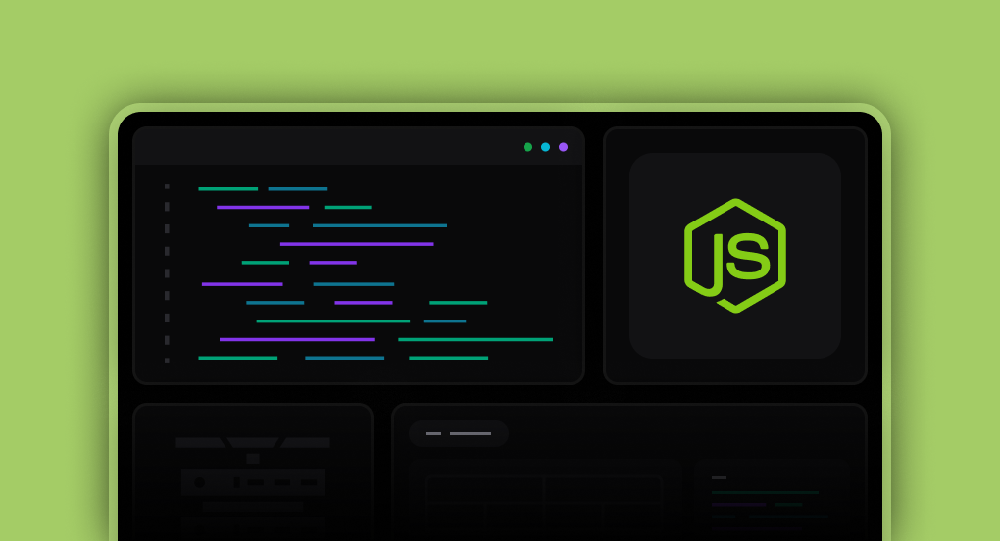

# Task Manager API



A RESTful API for managing tasks, teams, and users built with Node.js and Express.js.

## Technologies

### Backend

- **Framework**: Express.js
- **Database**: PostgreSQL
- **ORM**: Prisma
- **Language**: TypeScript
- **Validation**: Zod
- **Authentication**: JWT
- **Testing**: Jest
- **Containerization**: Docker
- **Deployment**: Render

## Features

### Authentication & Authorization

- User registration and login
- JWT-based authentication
- Role-based access control:
  - **Admin**: Manages users and teams
  - **Member**: Manages assigned tasks

### Team Management

- Admin-only team creation and editing
- Admin-only member addition/removal

### Tasks

- Full CRUD operations (Create, Read, Update, Delete)
- Status: "Pending", "In Progress", "Completed"
- Priority: "High", "Medium", "Low"
- Task assignment to specific team members

### User Roles

#### Admin

- View and manage all tasks, users, and teams

#### Member

- View team tasks
- Edit only own tasks

## Getting Started

### Prerequisites

- Node.js
- PostgreSQL
- Docker (optional)

### Installation

1. Clone the repository
2. Install dependencies:

```bash
npm install
```

3. Set up environment variables:

```bash
cp .env.example .env
```

4. Run database migrations:

```bash
npx prisma migrate dev
```

5. Start the development server:

```bash
npm run dev
```
